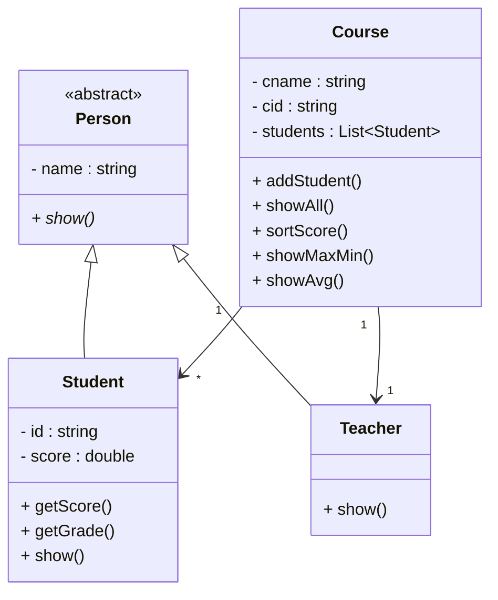

```mermaid
classDiagram

class Person {
    <<abstract>>
    - name : string
    + show()*
}

class Student {
    - id : string
    - score : double
    + getScore()
    + getGrade()
    + show()
}

class Teacher {
    + show()
}

class Course {
    - cname : string
    - cid : string
    - students : List~Student~
    + addStudent()
    + showAll()
    + sortScore()
    + showMaxMin()
    + showAvg()
}

Person <|-- Student
Person <|-- Teacher
Course "1" --> "*" Student
Course "1" --> "1" Teacher
```
